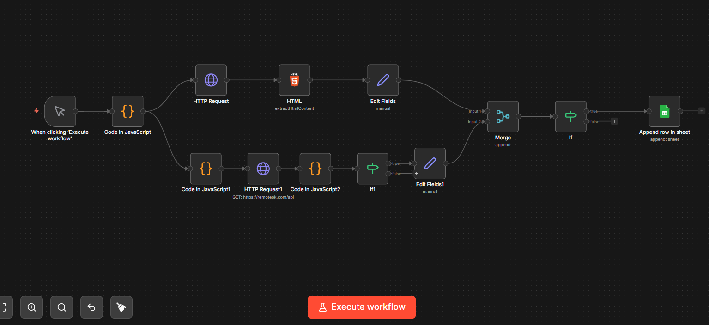
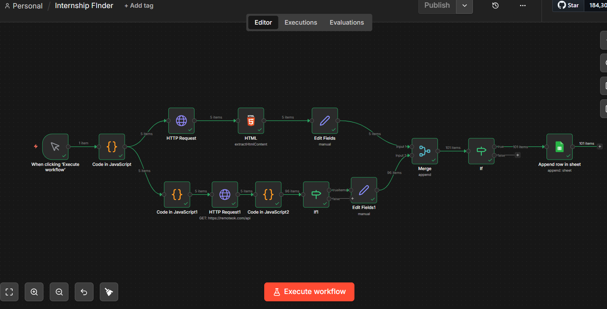

## 🧠 The Idea

> What if internships found **you**, instead of you searching for them?

This project is a **smart automation system** that continuously scans multiple sources, filters relevant roles, and builds a **live internship database** — automatically.

---

## ⚙️ System Flow

```text id="flow01"
⏱️ Trigger (Cron)
      ↓
🌐 Multi-Source Data Collection
      ↓
🧩 Data Extraction (HTML / APIs)
      ↓
🧠 Data Structuring (Set Nodes)
      ↓
🔗 Merge Pipelines
      ↓
🎯 Intelligent Filtering
      ↓
📊 Google Sheets Database
```

---

## ✨ What Makes This Different

🚀 Not just scraping — it's an **automation pipeline**
🧠 Structured like a **real data engineering system**
⚡ Runs automatically without manual effort
📊 Builds a **centralized opportunity tracker**

---

## 🔍 Features

* 🔄 Automated internship discovery
* 🌍 Multi-platform data collection
* 🧹 Clean & structured data pipeline
* 🎯 Smart filtering system
* 📊 Real-time tracking using Google Sheets

---

## 🛠 Tech Stack

```text id="stack01"
Automation Engine → n8n
Data Collection   → HTTP Requests / APIs
Parsing           → HTML Extract
Processing        → JavaScript Logic
Storage           → Google Sheets
```

---

## 📸 Visual Preview

### ⚡ Workflow



### 📊 Output Dashboard



---

## 🚀 How to Run

```bash id="run01"
1. Install n8n
2. Import workflow JSON
3. Connect Google Sheets
4. Run workflow
```

---

## 📈 Future Evolution

This is just Version 1.

Next upgrades:

* 🤖 AI-powered internship ranking
* 📩 Auto email application system
* 🧠 Resume & cover letter generation
* 🌐 Expand to 50+ job sources

---

## 💡 What I Built Through This

This project represents:

✔ Real-world automation
✔ Data pipeline thinking
✔ API integration skills
✔ Problem-solving approach

---

## 👩‍💻 Creator

**Varshini Gurram**
Building at the intersection of **AI × Automation × Real Problems**

---

<p align="center">
⭐ If you found this interesting, consider starring the repo!
</p>
